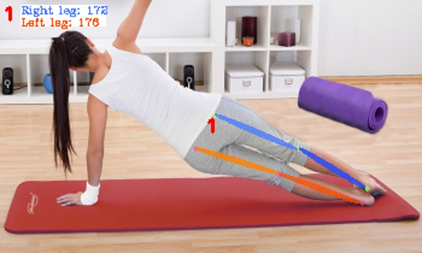

# LegPoseDetector
LegPoseDetector es un software que nace como modificación de [AlphaPose](https://github.com/MVIG-SJTU/AlphaPose), buscando centrarse en la detección de las piernas de las personas.

<div align="center">
    
</div>

LegPoseDetector añade las siguientes características:
- Cálculo y visualización del ángulo de cada pierna.
- Límite del número máximo de personas a detectar.
- Carga de resultados desde fichero JSON.

## Instalación
```shell
# 1. Instalar PyTorch
pip3 install torch==1.1.0 torchvision==0.3.0

# 2. Obtener AlphaPose
git clone https://github.com/enaes05/LegPoseDetector.git
cd LegPoseDetector

# 3. Instalar
export PATH=/usr/local/cuda/bin/:$PATH
export LD_LIBRARY_PATH=/usr/local/cuda/lib64/:$LD_LIBRARY_PATH
pip install cython
sudo apt-get install libyaml-dev
python setup.py build develop --user
```

### Preparación
1. Para descargar el detector de objetos: **yolov3-spp.weights**([Google Drive](https://drive.google.com/open?id=1D47msNOOiJKvPOXlnpyzdKA3k6E97NTC) | [Baidu pan](https://pan.baidu.com/s/1Zb2REEIk8tcahDa8KacPNA)). Se coloca en `detector/yolo/data`.

2. Para descargar el identificador de pose: **JDE-1088x608-uncertainty**([Google Drive](https://drive.google.com/open?id=1nlnuYfGNuHWZztQHXwVZSL_FvfE551pA) | [Baidu pan](https://pan.baidu.com/s/1Ifgn0Y_JZE65_qSrQM2l-Q)). Se coloca en `detector/tracker/data`.

3. Se debe descargar la base de datos de imágenes con sus respectivas anotaciones desde [COCO](https://cocodataset.org/#download).

4. Se pueden descargar modelos ya entrenados. Para ello se puede consultar la documentación original de AlphaPose, en https://github.com/MVIG-SJTU/AlphaPose/blob/master/docs/MODEL_ZOO.md

5. Los modelos entrenados de los ficheros de configuración de este proyecto se pueden descargar desde [Google Drive](https://drive.google.com/drive/folders/1B5gfKdPzo0XrU35iDIe9_Ph16_OVX-PW).

## Cómo entrenar
```python3 ./scripts/train.py --cfg fichero_configuracion --exp-id identificador_entrenamiento```

## Cómo validar
```python3 ./scripts/validate.py --cfg fichero_configuracion --checkpoint modelo --gpus gpus_a_usar --batch 20```

## Cómo testear imágenes
```python3 ./scripts/test.py --cfg fichero_configuracion --checkpoint modelo --save_img --detbatch 1 --posebatch 30 --image archivo_imagen```

Las imágenes se guardan por defecto en ```/examples/res/vis```. Para cambiar el directorio, se usa el parámeto ```--outdir directory```.

## Cómo testear vídeos
```python3 ./scripts/test.py --cfg fichero_configuracion --checkpoint modelo --save_video --detbatch 1 --posebatch 30 --video archivo_video```

Los vídeos se guardan por defecto en ```/examples/res```. Para cambiar el directorio, se usa el parámeto ```--outdir directory```.

## Testear desde fichero JSON
```python3 ./scripts/test.py --cfg fichero_configuracion --checkpoint modelo --save_img --detbatch 1 --posebatch 30 --image archivo_imagen --json archivo_json```
