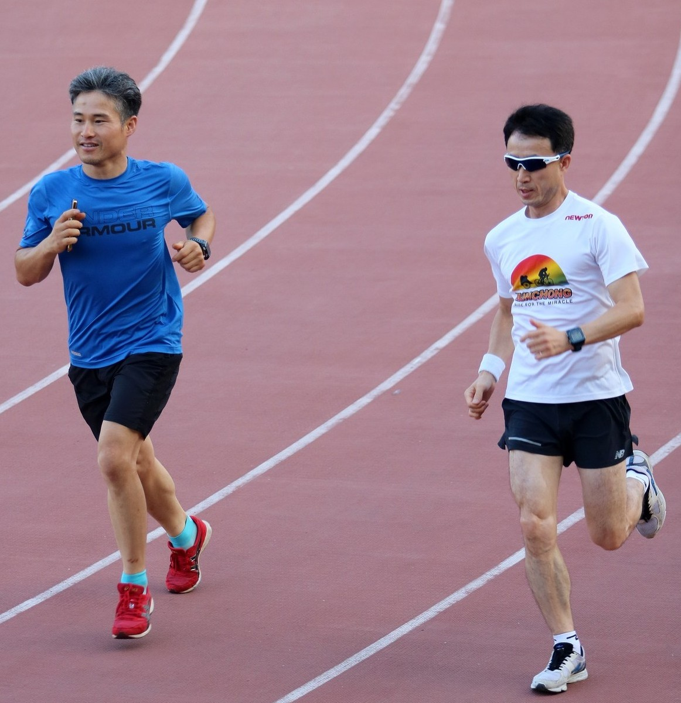
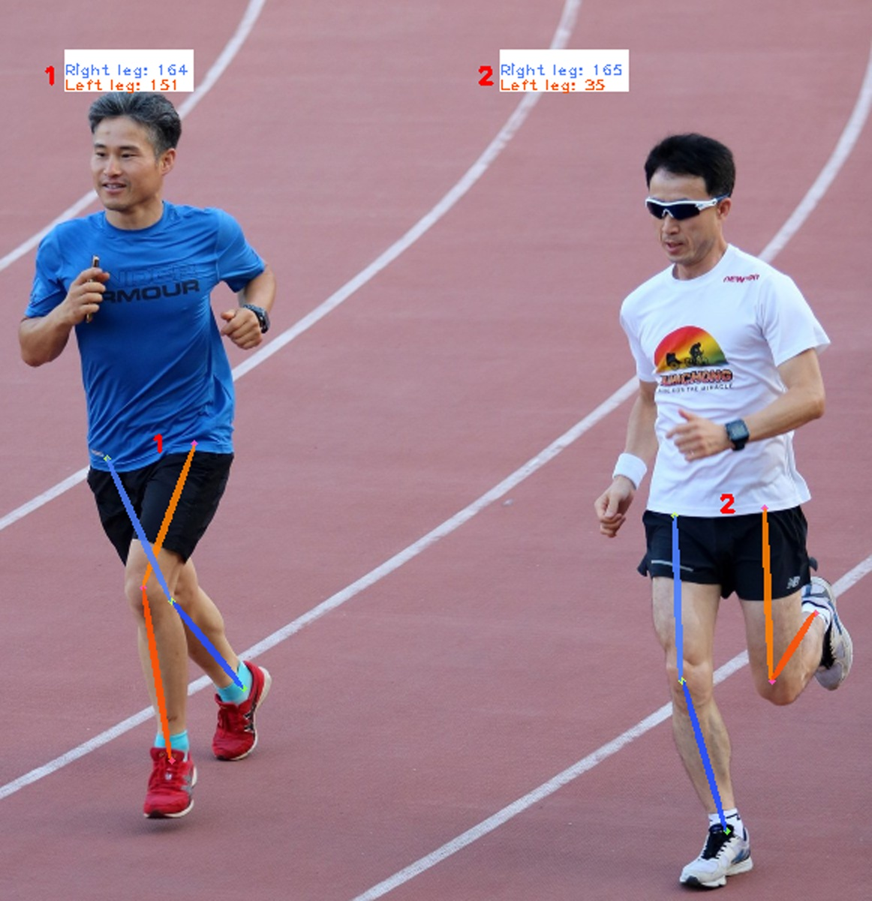

# LegPoseDetector
LegPoseDetector es un software que nace como modificación de [AlphaPose](https://github.com/MVIG-SJTU/AlphaPose), buscando centrarse en la detección de las piernas de las personas.

<div align="center">
    
</div>

LegPoseDetector añade las siguientes características:
- Cálculo y visualización del ángulo de cada pierna.
- Límite del número máximo de personas a detectar.
- Carga de resultados desde fichero JSON.

## Instalación
```shell
# 0. Crear directorio virtual (opcional)
python3 -m venv directorio_virtual
source directorio_virtual/bin/activate

# 1. Actualizar pip  
pip install --upgrade pip

# 2. Instalar PyTorch  
pip3 install torch==1.1.0 torchvision==0.3.0

# 3. Obtener el proyecto
git clone https://github.com/enaes05/LegPoseDetector.git
cd LegPoseDetector

# 4. Configurar path de CUDA  
export PATH=/usr/local/cuda/bin/:$PATH
export LD_LIBRARY_PATH=/usr/local/cuda/lib64/:$LD_LIBRARY_PATH

# 5. Instalar dependencias  
pip install cython
sudo apt-get install libyaml-dev
pip install -r requirements.txt
python setup.py build develop --user
```

### Preparación
1. Para descargar el detector de objetos: **yolov3-spp.weights**([Google Drive](https://drive.google.com/open?id=1D47msNOOiJKvPOXlnpyzdKA3k6E97NTC) | [Baidu pan](https://pan.baidu.com/s/1Zb2REEIk8tcahDa8KacPNA)). Se coloca en `detector/yolo/data`.

2. Para descargar el identificador de pose: **JDE-1088x608-uncertainty**([Google Drive](https://drive.google.com/open?id=1nlnuYfGNuHWZztQHXwVZSL_FvfE551pA) | [Baidu pan](https://pan.baidu.com/s/1Ifgn0Y_JZE65_qSrQM2l-Q)). Se coloca en `detector/tracker/data`.

3. Se debe descargar la base de datos de imágenes con sus respectivas anotaciones desde [COCO](https://cocodataset.org/#download).

4. Los modelos entrenados de este proyecto se pueden descargar desde [Google Drive](https://drive.google.com/drive/folders/1B5gfKdPzo0XrU35iDIe9_Ph16_OVX-PW). Los modelos pueden guardarse en cualquier carpeta, ya que al usarlos luego se selecciona su ubicación. Al realizar ejecuciones de test, cada modelo debe usarse junto al fichero de configuración con el que se ha entrenado. Dichos ficheros de configuración están el subdirectorio `configs`, y se usan los siguientes para los modelos que se ofrecen:

 Modelo | Fichero de configuración 
 --- | --- 
 fastpose_dcn.pth | fastpose_dcn.yaml 
 fastpose_duc_shuffle.pth | fastpose_duc_shuffle.yaml 
 
 Para cada modelo se exponen también sus métricas, para consultar sus parámetros se pueden observar sus respectivos ficheros de configuración:
 
 Modelo | MSE (Loss) | Accuracy | mAP (GT) | mAP (RCNN)
 --- | --- | --- | --- | ---
 fastpose_dcn.pth | 0.000487 | 0.7939 | 0.5950 | 0.6899
 fastpose_duc_shuffle.pth | 0.000469 | 0.8122 | 0.5960 | 0.6873

### Prueba rápida
Si queremos hacer una prueba rápida para comprobar los resultados del programa al estimar la pose, podemos usar la siguiente imagen:
<div align="center">
    
</div>

Se utilizará el modelo con arquitectura **FastPose + DUC (Shuffle)**, que puede obtenerse en el paso 4 del apartado de **Preparación**. El comando sería el siguiente:

```python3 ./scripts/test.py --save_img --detbatch 1 --posebatch 30 --cfg ./configs/exp1/fastpose_duc_shuffle.yaml --checkpoint fastpose_duc_shuffle.pth --image try_me.jpg```

El resultado debería ser el siguiente, se guarda por defecto en el directorio ```/examples/res/vis```:
<div align="center">
    
</div>

## Cómo entrenar
```python3 ./scripts/train.py --cfg fichero_configuracion --exp-id identificador_entrenamiento```

## Cómo validar
```python3 ./scripts/validate.py --cfg fichero_configuracion --checkpoint modelo --gpus gpus_a_usar --batch 20```

## Cómo testear imágenes
```python3 ./scripts/test.py --cfg fichero_configuracion --checkpoint modelo --save_img --detbatch 1 --posebatch 30 --image archivo_imagen```

Las imágenes se guardan por defecto en ```/examples/res/vis```. Para cambiar el directorio, se usa el parámeto ```--outdir directory```.

## Cómo testear vídeos
```python3 ./scripts/test.py --cfg fichero_configuracion --checkpoint modelo --save_video --detbatch 1 --posebatch 30 --video archivo_video```

Los vídeos se guardan por defecto en ```/examples/res```. Para cambiar el directorio, se usa el parámeto ```--outdir directory```.

## Visualizar pose desde fichero JSON
```python3 ./scripts/test.py --cfg fichero_configuracion --checkpoint modelo --save_img --detbatch 1 --posebatch 30 --image archivo_imagen --json archivo_json```
